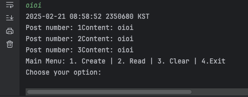

# Bugs
1. mainmenu2 골랐을때 바로 게시물 목록을 읽는다 -> 바로 읽지 않고 submenu가 먼저 호출 되어야 한다. 
2. submenu 2 - List - number of post? 숫자 입력했을때 모든 게시물이 출력된다 -> 특정 게시물만 출력 되어야 한다. 
3. menu 1- create 로 게시물 생성했을때 모든 포스트의 content가 입력한 내용 oioi로 변경되어 출력된다.

4. 제일 처음 메뉴 입력 받을때 예외처리 되지 않는다. -> 숫자가 아닌 문자 들어올 경우 예외 처리 해준다. 
5. 제일 처음 메뉴 입력 받을 시 제시된 숫자가 입력된 경우 프로그램이 비정상적으로 종료 된다 -> 잘못된 숫자가 입력된 경우 예외 처리 한다. 
6. 게시물 생성시 예외 처리 되어야 한다. 
7. submenuof2 에서 허용되는 숫자 아닌 경우 메시지 무한 반복 출력된다. 
8. menu 2 - submenu 1 (update) 입력시 보조메뉴 출력문 2번 반복된다. 1번만 출력되어야 한다. 
9. writer 필드가 null 로 출력된다. 
10. 아무 보드도 게시판에 없을경우 사용자가 읽을 번호를 선택하려 할때 아무 보드도 없다고 출력한다. 
# Refactor 
- 예외처리 시 프린트할 메시지를 변수로 처리한다. 
- 해쉬맵에서 보드 객체가 생성 될때마다 객체들의 키값이 자동으로 1증가 되도록 한다. 
# Required features 
- submenu of menu1. 
- 
# Things to Improve
1. 프린트 형식 정확하게 맞추기. 
2. 입력 예외 처리하기. 
3. 인터페이스나/ 추상 클래스

4. 예외 처리 한것을 로그 파일에 기록하기. 
5. 입력된 게시물을 파일로 저장하기. 

# Things to Remember
- throw new ExceptionClass 하면 프로그램 종료됨. 
